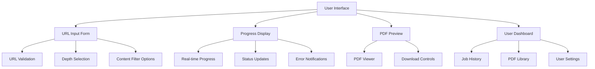
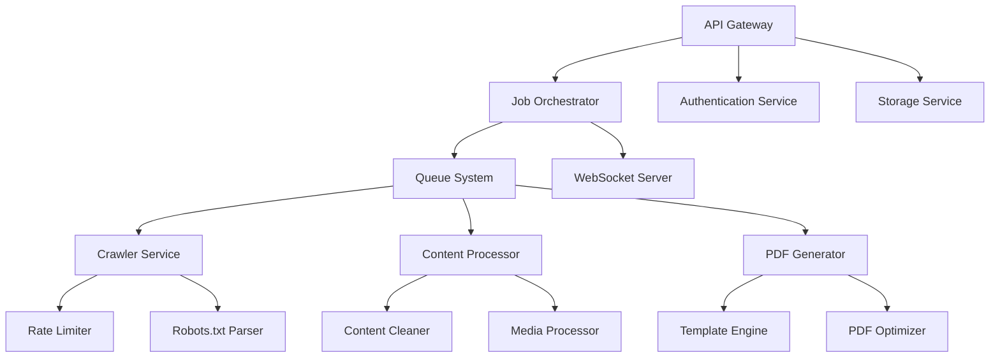
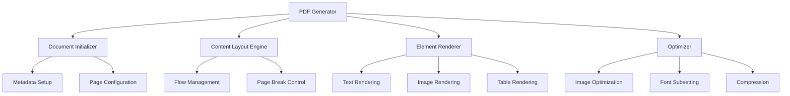

# PDFBooker Architecture Design

## 1. System Overview

PDFBooker is a web application that transforms web content into professionally formatted PDF books. The system consists of several interconnected components that work together to provide a seamless user experience.

## 2. Component Architecture

### 2.1 Frontend Components (Next.js + Shadcn UI)

#### Key Frontend Components:
1. **URL Input Form**
   - URL input with validation
   - Crawl depth selector
   - Content filter options
   - Template selection
   - Custom styling options

2. **Progress Display**
   - Real-time progress indicators
   - Status updates
   - Error notifications
   - Estimated completion time

3. **PDF Preview**
   - Interactive PDF viewer
   - Download controls
   - Share options

4. **User Dashboard**
   - Job history
   - PDF library
   - User settings
   - Usage statistics

### 2.2 Backend Server Architecture

#### Key Backend Services:
1. **API Gateway**
   - Request routing
   - Rate limiting
   - Authentication
   - Request validation

2. **Job Orchestrator**
   - Job scheduling
   - Resource allocation
   - Progress tracking
   - Error handling

3. **Queue System**
   - Job queuing
   - Priority management
   - Retry mechanisms
   - Dead letter handling

4. **WebSocket Server**
   - Real-time updates
   - Connection management
   - Event broadcasting

### 2.3 Content Processing Pipeline

#### Processing Stages:
1. **URL Validation & Normalization**
   - URL syntax validation
   - Domain verification
   - URL normalization

2. **Web Crawling**
   - Depth-limited crawling
   - Rate limiting
   - Robots.txt compliance
   - Link extraction

3. **Content Extraction**
   - Main content detection
   - Metadata extraction
   - Structure preservation
   - Element classification

4. **Content Cleaning**
   - Ad removal
   - Navigation stripping
   - Style normalization
   - Code block preservation

5. **Media Processing**
   - Image optimization
   - Asset downloading
   - Format conversion
   - Alt text preservation

6. **Content Organization**
   - Structure analysis
   - Reading order determination
   - Link resolution
   - Cross-reference handling

### 2.4 PDF Generation Module

#### PDF Generation Components:
1. **Document Initialization**
   - Page setup
   - Metadata configuration
   - Font registration
   - Style definitions

2. **Content Layout Engine**
   - Text flow management
   - Page break control
   - Column layout
   - Responsive handling

3. **Element Renderer**
   - Text formatting
   - Image placement
   - Table rendering
   - Code block formatting

4. **Optimizer**
   - Image optimization
   - Font subsetting
   - Compression
   - Quality assurance

## 3. Data Flow

### 3.1 User Request Flow
1. User submits URL and configuration
2. Frontend validates input
3. API Gateway receives request
4. Job Orchestrator creates job
5. Queue System processes job
6. Results returned to user

### 3.2 Content Processing Flow
1. Crawler fetches web content
2. Content Processor extracts and cleans
3. Media Processor handles assets
4. Content Organizer structures data
5. PDF Generator creates document
6. Storage Service saves result

### 3.3 Progress Update Flow
1. Processing stages emit events
2. WebSocket Server broadcasts updates
3. Frontend receives and displays progress
4. User sees real-time updates

## 4. Technology Stack

### Frontend
- Next.js (React framework)
- TypeScript
- Shadcn UI (component library)
- Tailwind CSS (styling)
- WebSocket client (real-time updates)

### Backend
- Node.js
- Express.js
- TypeScript
- Redis (queue system)
- MongoDB (data storage)
- Puppeteer (web scraping)
- PDFKit (PDF generation)

### Infrastructure
- Docker (containerization)
- Kubernetes (orchestration)
- AWS/GCP (cloud hosting)
- Redis (caching)
- MinIO (object storage)

## 5. Security Considerations

1. **Input Validation**
   - URL sanitization
   - Content filtering
   - Rate limiting
   - CORS protection

2. **Authentication**
   - JWT tokens
   - OAuth integration
   - Session management
   - Role-based access

3. **Data Protection**
   - Encryption at rest
   - Secure transmission
   - Data isolation
   - Regular backups

4. **Resource Protection**
   - Rate limiting
   - Request validation
   - Resource quotas
   - Monitoring

## 6. Scalability Considerations

1. **Horizontal Scaling**
   - Stateless services
   - Load balancing
   - Auto-scaling
   - Service discovery

2. **Performance Optimization**
   - Caching strategies
   - Database indexing
   - Query optimization
   - Asset optimization

3. **Monitoring**
   - Health checks
   - Performance metrics
   - Error tracking
   - Usage analytics

4. **Resilience**
   - Circuit breakers
   - Retry mechanisms
   - Fallback strategies
   - Disaster recovery 